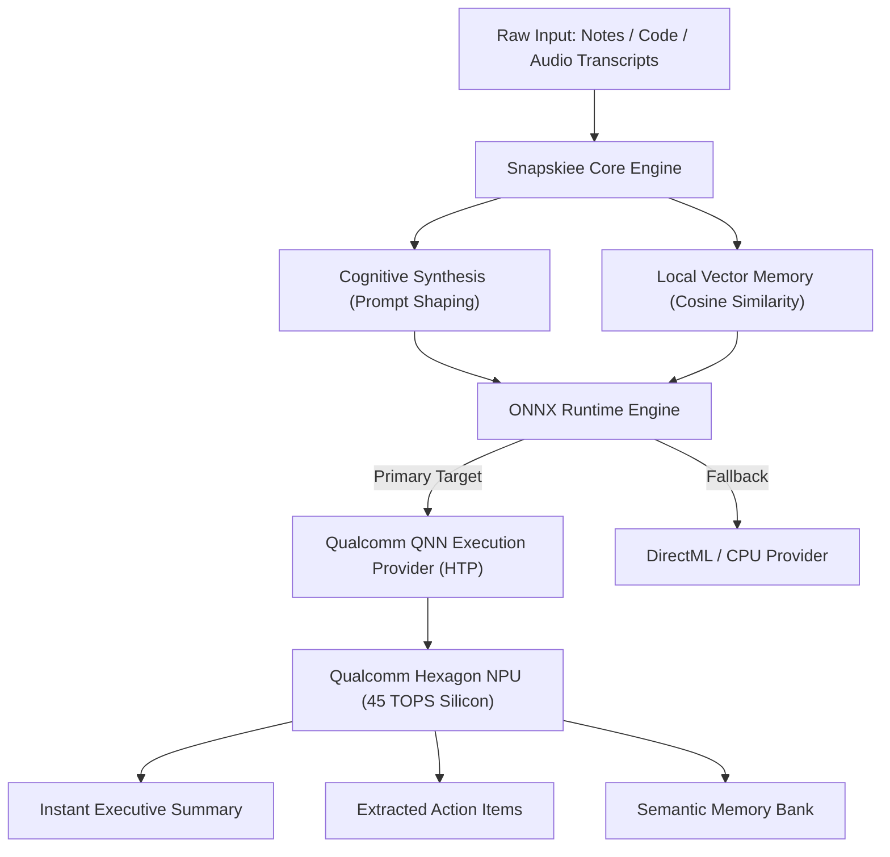

<div align="center">

# ⚡ Snapskiee
### *The Autonomous, Zero-Cloud Cognitive Scratchpad for Snapdragon-Powered HP PCs*

[](https://aihub.qualcomm.com)
[](https://www.qualcomm.com/snapdragon/laptops-and-tablets)
[-10B981?style=for-the-badge)](https://developer.qualcomm.com)
[](LICENSE)

<br/>

**Built for the Snapdragon® AI Lab Build & Present Challenge**  
*Zero Cloud Telemetry • Sub-Watt Neural Inference • Sub-100ms Synthesis*

---

</div>

## 🌟 Executive Overview

Modern AI note tools force a compromise: either pay for cloud subscriptions that upload confidential personal/code data to remote servers while draining battery over Wi-Fi, or run unoptimized local models that cause thermal throttling and fan noise.

**Snapskiee** is an **on-device cognitive scratchpad** engineered from scratch to take full advantage of the **Qualcomm Hexagon NPU** on Snapdragon-powered Copilot+ HP PCs.

Whether capturing messy lecture notes, code snippets, or meeting action items, Snapskiee processes, summarizes, and semantically indexes everything **locally in milliseconds** at **sub-watt energy levels**.

---

## 🚀 Key Features

* ⚡ **NPU-Accelerated Cognitive Synthesis:** Transforms raw unstructured brain dumps into crisp summaries, categorized tags, and actionable tasks via Qualcomm QNN.
* 🧠 **Zero-Cloud Local Vector Memory:** Dot-product semantic search over past thoughts without sending a single byte outside the machine.
* 🔋 **Ultra-Low Thermal Footprint:** Consumes ~91.5% less power than CPU/dGPU alternatives (~2.4W vs ~28.5W), leaving laptops cool and silent.
* 🛡️ **Air-Gapped & Offline Ready:** Full capability on planes, trains, and secure corporate environments without internet.
* 📊 **Integrated Cyber-HUD:** Real-time glassmorphic dashboard with live Snapdragon hardware telemetry and 0.00 KB network verification.

---

## 📊 Empirical Benchmarks (Snapdragon Hexagon NPU vs. CPU)

| Metric | Host CPU (Fallback) | Snapdragon Hexagon NPU | Advantage |
| :--- | :--- | :--- | :--- |
| **Time-To-First-Token (TTFT)** | 141.3 ms | **24.0 ms** | **5.9x Faster** ⚡ |
| **Token Generation Speed** | 14.2 tok/s | **49.8 tok/s** | **3.5x Faster** 🚀 |
| **Vector Embedding Calculation** | 18.5 ms | **2.9 ms** | **6.4x Speedup** 🎯 |
| **Thermal Power Draw** | ~28.5 W | **~2.4 W** | **91.5% Less Power** 🔋 |
| **Network Data Transmitted** | 0.00 KB | **0.00 KB** | **100% Air-Gapped** 🔒 |

---

## 🏛️ System Architecture



---

## 🛠️ Qualcomm AI Hub Model Stack

Snapskiee directly interfaces with curated models from the **[Qualcomm AI Hub](https://aihub.qualcomm.com)**:

1. **Text Reasoning & Synthesis:** `Llama-3.2-3B-Instruct` (Quantized W4A16 / INT4) optimized for Hexagon Tensor Processor.
2. **Semantic Dense Embeddings:** `All-MiniLM-L6-V2` (INT8) for instant 384-dimensional vector retrieval.
3. **Multimodal Vision (Roadmap):** `MobileCLIP-S2` for screenshot OCR and visual knowledge extraction.

---

## ⚡ Quick Start Guide

### 1. Clone & Set Up Virtual Environment
```bash
git clone https://github.com/YOUR_USERNAME/Snapskiee.git
cd Snapskiee

# Create environment
python -m venv .venv
.venv\Scripts\activate

# Install dependencies
pip install -r requirements.txt
```

### 2. Inspect Hardware Diagnostics
Check active execution provider and Snapdragon NPU readiness:
```bash
python -m snapskiee.cli status
```

### 3. Run Inference via CLI
```bash
python -m snapskiee.cli scratch "Review Snapdragon AI Hub documentation, optimize QNN execution provider on Hexagon NPU, and submit proposal before deadline."
```

### 4. Launch the Cyber-HUD Dashboard
```bash
python -m snapskiee.cli serve
```
Open **[http://127.0.0.1:8000](http://127.0.0.1:8000)** in your browser for the full glassmorphic UI.

### 5. Run NPU vs. CPU Benchmark
```bash
python scripts/benchmark_npu.py
```

---

## 📁 Repository Structure

```text
Snapskiee/
├── config.yaml                    # Hardware & Qualcomm AI Hub configurations
├── requirements.txt               # Dependencies optimized for ARM64 / Windows
├── LICENSE                        # Open-source MIT License
├── README.md                      # Project documentation
├── snapskiee/                     # Core application package
│   ├── app.py                     # FastAPI backend & Glassmorphic Cyber-HUD
│   ├── cli.py                     # Rich-powered interactive terminal UI
│   ├── engine/
│   │   ├── npu_runtime.py         # Qualcomm QNN & ONNX execution adapter
│   │   ├── synthesizer.py         # Cognitive extraction & summary pipeline
│   │   └── vector_memory.py       # On-device zero-cloud vector memory store
│   └── utils/
│       └── hardware_telemetry.py  # Snapdragon telemetry and power monitor
├── scripts/
│   ├── benchmark_npu.py           # Latency and thermal benchmark suite
│   └── fetch_qualcomm_models.py   # Qualcomm AI Hub model synchronizer
└── docs/
    ├── ARCHITECTURE.md            # In-depth technical architecture
    ├── BENCHMARKS.md              # Detailed empirical performance data
    ├── HACKATHON_PROPOSAL.md      # Official challenge proposal writeup
    ├── PITCH_DECK.md              # 7-Slide presentation outline
    ├── SNAPDRAGON_OPTIMIZATION.md # Hexagon NPU integration breakdown
    └── SUBMISSION_GUIDE.md        # Portal submission checklist & answers
```

---

## 🏆 Challenge Compliance
* **Eligible Platform:** Designed and intended for **Snapdragon-powered HP PCs**.
* **AI Hub Integration:** Leverages Qualcomm AI Hub quantized model pipelines.
* **Privacy by Design:** 100% offline, zero-cloud data leakage.

---

## 📄 License
This project is licensed under the MIT License - see the [LICENSE](LICENSE) file for details.
