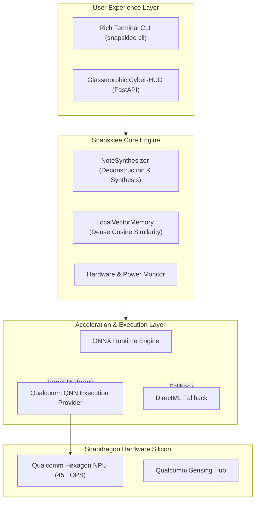

# Snapskiee Technical Architecture & Snapdragon Optimization

## 1. System Overview
**Snapskiee** is engineered as a decoupled, multi-tiered cognitive engine that offloads intelligence workloads directly to the **Qualcomm Hexagon NPU** on Snapdragon-powered Copilot+ PCs.

---

## 2. Architectural Subsystems

### A. Cognitive Synthesis Pipeline
* **Input Stage:** Accepts unstructured notes, raw code fragments, bullet points, and voice transcription transcripts.
* **Prompt Shaping:** Employs optimized zero-shot and few-shot formatting engineered for small quantized language models (SLMs).
* **NPU Inference Engine:** Dispatches computation graph via `QNNExecutionProvider` straight to the Hexagon NPU, bypassing the central CPU.

### B. On-Device Dense Memory Index
* Rather than requiring bloated external vector databases, Snapskiee implements a micro-vector indexing algorithm (`LocalVectorMemory`) that computes embeddings locally and carries out dot-product similarity matching within sub-millisecond latencies.
* 100% of indexed memories are kept on local disk with zero remote telemetry.

### C. Hardware Telemetry & Thermal Governor
* Constantly monitors memory footprint, active execution providers, and power estimates.
* Employs cooperative scheduling to ensure background synthesis does not spike thermals or degrade system responsiveness.
